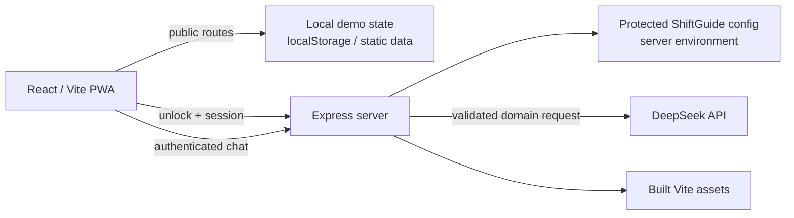

# ProtoCap

[](https://github.com/AmineAKIK/protocap/actions/workflows/ci.yml)

**Engineering portfolio and interactive demonstrator for industrial operations — guided work, local traceability, logistics workflows, packaging calculations and AI-assisted decision support.**

[Open ProtoCap](https://protocap-production.up.railway.app/) · [Try ShiftGuide demo](https://protocap-demo-production.up.railway.app/demo) · [Architecture](docs/architecture.md) · [Product boundaries](docs/product-boundaries.md) · [Quality evidence](docs/quality-gates.md) · [Security](SECURITY.md) · [Licensing](LICENSING.md)

ProtoCap is a public engineering demonstrator built around recurring shop-floor frictions: fragmented operational information, manual checks, logistics requests, packaging calculations and guided decision support. It combines browser-local prototypes with the protected **ShiftGuide** workspace and its server-mediated AI guide, **Céline**.

The repository deliberately distinguishes **implemented behavior**, **synthetic demonstration**, **browser-local state**, **protected runtime configuration** and **future operational integrations**. It is an engineering portfolio and product exploration, not evidence of an industrial deployment or measured business impact.

## Start here

- **Public ProtoCap:** open the hosted application to inspect the public modules and product boundaries.
- **ShiftGuide public demo:** open the isolated demo origin above. It uses fictitious fixtures and scripted responses, requires no maintainer secret, and never calls the external AI provider.
- **Protected ShiftGuide:** the production-origin route remains access-controlled. Its protected configuration and real provider path are not exposed by the public demo.

## What this portfolio demonstrates

The verifiable evidence is the repository itself: implementation commits, pull requests, automated tests, architecture decisions and dated release-evidence records. The public repository does **not** infer solo authorship of every operational idea or document, a completed industrial rollout, time savings, productivity gains or business KPIs from commit counts or prototype behavior.

Three engineering decisions are especially visible:

1. **Trust boundaries are explicit.** Public browser-local prototypes, protected ShiftGuide configuration and the isolated synthetic ShiftGuide demo are separate runtime boundaries.
2. **Failure states stay visible.** Local persistence failures, future schema versions and unavailable coordination do not become silent success confirmations.
3. **Céline is not an operational-content authority.** The server owns authentication, routing, canonical procedure wording and provider credentials; the external model selects bounded decisions rather than authoring procedure text.

Co-authored, third-party and operational materials may have rights or provenance distinct from the software implementation; see [LICENSING.md](LICENSING.md). Historical evidence is kept as history rather than rewritten to look current.

## What is implemented

| Surface | Current implementation | Data / runtime boundary |
| --- | --- | --- |
| **ShiftGuide** | Protected operator guidance, modules, lexicon, emergencies and shared progress | Protected configuration is served after server-side unlock; progress is browser-persisted |
| **Céline** | AI-assisted conversational guidance inside ShiftGuide | Server-side prompt/provider boundary; requires a valid ShiftGuide session and network access |
| **LinePulse** | Multi-role operational-visibility concept | **Demonstration using static mock data**; no live plant feed is connected |
| **Expiry Check** | Validity tracking and local action history | Browser-local persistence; no shared quality backend |
| **Logistics Call** | Request creation, prioritisation and status workflow | Browser-local demonstration; **not multi-user or real-time synchronised** |
| **Knowledge Base** | Searchable operational reference interface | Static repository content |
| **Packing Calculator** | Packaging calculations with selectable rounding policies and a manual pallet-dispatch counter | Calculation and dispatch progress are browser-local; no shared operational source of truth |
| **Pilot proposal** | Public three-page proposal for a controlled sampling-reminder pilot | Working proposal only; it is not evidence of a deployed integration |

All public demonstration data is fictitious. Operational or co-authored documents remain outside the software-license perimeter unless expressly stated otherwise; see [LICENSING.md](LICENSING.md).

## Architecture



The application is a React SPA served by Express. Public prototypes primarily run in the browser. ShiftGuide forms a separate protected boundary: its code is public, but its operational configuration is loaded from server-side environment variables and returned only after a successful unlock.

Céline never receives the provider key in the browser. The Express boundary owns authentication checks, IP/session rate limiting, payload limits, timeout handling, the system prompt and the upstream AI request. Provider checklist output is validated server-side and hydrated from canonical ShiftGuide action data before it is returned to the browser, so the model does not author operational action text.

For a more detailed view, including trust boundaries and current trade-offs, see [docs/architecture.md](docs/architecture.md). Historical implementation plans such as `docs/celine-v3-plan.md` are retained as engineering records; they are not the current architecture source of truth.

## Security decisions

The current server boundary intentionally includes:

- server-only `SHIFTGUIDE_CODE` and `DEEPSEEK_API_KEY` configuration;
- timing-safe unlock-code comparison;
- random bearer session tokens with an eight-hour TTL enforced by both server and browser state;
- unlock throttling plus per-session and per-IP chat throttling;
- request-size limits and generic server/provider error responses;
- provider timeout and output-token limits;
- canonical server hydration of Céline procedure actions;
- restrictive security headers, including CSP, frame protection and no-store API responses;
- protected ShiftGuide configuration returned only after successful authentication.

This is intentionally **not described as a distributed production architecture**. Sessions and rate-limit state currently live in process memory, so a process restart invalidates sessions and multiple replicas would not share that state. That trade-off is acceptable for the current hosted demonstrator and is documented rather than hidden.

## PWA and offline behavior

The Vite PWA service worker pre-caches built static assets and supports standalone installation. Offline capability is therefore **partial**:

- already-cached static UI and browser-local prototypes can remain available depending on the cached route/assets;
- Céline, ShiftGuide session validation/unlock and any other server-dependent behavior require network access;
- no claim is made that the complete application is operational offline.

## Quality gate

`main` is protected by repository rules and changes are reviewed through pull requests. The canonical local check is:

```bash
npm run check
```

It runs server syntax checks, the Node test suite, the frontend Vitest suite with coverage floors, ESLint with zero tolerated warnings, TypeScript and the production Vite build. GitHub Actions additionally verifies generated directories are not tracked, builds the production Docker image, installs Chromium and WebKit, runs the critical desktop Chromium journeys, focused mobile Chromium/WebKit browser smoke tests and axe accessibility regression scans, then audits production dependencies.

The automated suite covers server/runtime security helpers, ShiftGuide validation and progress semantics, session/rate-limit behavior, Céline prompt/provider/domain contracts, browser authentication boundaries, shared UI primitives, packaging invariants, critical ShiftGuide browser journeys, responsive/PWA smoke behavior and automated accessibility regressions. Coverage and browser evidence are engineering checks, not claims of industrial validation.

## Local development

Node.js 24 LTS is the repository reference version (`.nvmrc`). Runtime modes are intentionally separate:

```bash
npm ci
npm run dev       # public Vite UI only
npm run dev:full  # Vite + configured local API; loads .env.local explicitly when present
npm run demo      # synthetic full-stack demo, no private key and no external AI provider
npm run build
npm start         # production Express runtime serving dist/
npm run preview   # static Vite preview only; not the application server
```

`dev:full` binds the frontend and API to loopback by default. Copy `.env.example` to `.env.local` only when server-backed local development is required; no command assumes that a `.env` file is loaded implicitly.

The `demo` command injects repository-owned fictitious ShiftGuide fixtures and a scripted Céline provider. It rejects an inherited `DEEPSEEK_API_KEY`, never falls back to DeepSeek, and is not evidence of real provider quality or operational data. The hosted demo origin is a ShiftGuide-only surface, not a second ProtoCap SPA: only `/demo` and `/shiftguide/*` are served as application routes. Any other browser route is redirected to the configured real ProtoCap origin, and quitting ShiftGuide demo returns there as a full cross-origin navigation. A permanent simulation notice remains visible. `PUBLIC_DEMO_URL` is the verified isolated demo origin; `PROTOCAP_PUBLIC_URL` is the verified real application origin used for exits and non-ShiftGuide redirects.

Server-backed ShiftGuide/Céline development uses the variables documented in `.env.example`. Secrets must remain server-side. Do not use `VITE_*` names for secrets: Vite-prefixed variables belong to the client-facing build namespace.

## Deployment

The public demonstrator is hosted on Railway. The repository root `Dockerfile` is the production build/runtime source of truth: a Node 24 build stage installs the locked dependency graph and compiles the Vite bundle, then a separate Node 24 runtime stage installs production dependencies only and runs `node server.mjs` as the non-root `node` user. `.dockerignore` keeps generated, test and documentation material out of the Docker build context.

Railway automatically detects the root `Dockerfile`. Deployment health and restart policy are configured on the Railway service itself: `/api/ready` is the readiness gate, while `/api/health` remains the lightweight process-liveness endpoint. The readiness probe validates local ShiftGuide/Céline bootstrap capabilities without pinging DeepSeek. The deprecated `railway.toml`/Nixpacks configuration path is intentionally not used. Successful CI validates the repository and container build but is not presented as proof that an external Railway deployment completed successfully. See [docs/runtime-readiness.md](docs/runtime-readiness.md).

## Repository map

```text
.github/          CI, ownership and pull-request governance
server/           server-side security, runtime and provider boundaries
shared/           runtime contracts shared by browser and server
src/components/   shared UI and layout components
src/context/      application context providers
src/data/         public/static demo data and client references
src/features/     feature-level boundaries and API clients
src/hooks/        browser persistence and shared client behavior
src/pages/        public and ShiftGuide application surfaces
src/types/        client-side application contracts
src/utils/        pure helpers and domain calculations
tests/            Node server/runtime test suite
e2e/              critical Playwright browser journeys
docs/             architecture, product boundaries and archived source documents
Dockerfile        production container build/runtime contract
server.mjs        production process bootstrap
```

## Known boundaries

The most important current limitations are explicit:

- LinePulse is mock-driven, not connected to a live manufacturing feed;
- Logistics Call and Expiry Check are local demonstrations, not shared multi-user systems;
- PWA offline support does not include server-dependent features;
- ShiftGuide sessions and rate limits are process-local and therefore intentionally single-replica state;
- DeepSeek is the only production AI provider; there is no artificial multi-provider failover layer;
- browser-local demonstration persistence is not a substitute for a transactional backend.

See [docs/product-boundaries.md](docs/product-boundaries.md) for the detailed product-status matrix.

## Licensing

ProtoCap is **source-available software with non-commercial rights**. Original software code is licensed under the [PolyForm Noncommercial License 1.0.0](LICENSE).

The software license does not automatically cover reports, operational documentation, procedures, business proposals, prompts, workflow content, co-authored materials, trademarks or other non-software materials. Commercial use that is not permitted by an applicable license requires a separate written agreement.

Commercial licensing discussions are handled through **AkikSystems — contact@akiksystems.com**. See [LICENSING.md](LICENSING.md) for the exact perimeter.
