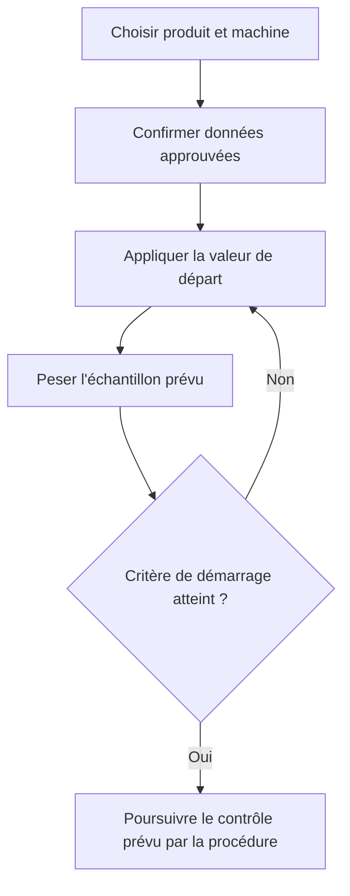

# Cadrage produit — Assistant de réglage de remplissage

**Version :** 0.1 — cadrage initial  
**Date :** 16 juillet 2026  
**Statut :** base de discussion à valider avec Production, Méthodes, Qualité et IT/OT

## 1. Décision produit

Le bon produit n’est pas une simple calculatrice de conversion. C’est un **assistant de réglage de remplissage** qui :

1. récupère ou fait confirmer les données approuvées du produit, du tube et de la machine ;
2. convertit la cible dans l’unité réellement utilisée par la remplisseuse ;
3. propose une valeur de départ explicable ;
4. guide l’échantillonnage de démarrage ;
5. calcule l’écart moyen et indique le sens de correction ;
6. mémorise le dernier réglage validé par couple produit–format–machine ;
7. laisse la décision de libération et les tolérances officielles aux procédures Qualité existantes.

**Promesse opérateur proposée :** « Sans refaire la conversion à la main, je sais quelle cible utiliser, quoi saisir ou dans quel sens régler, puis je vois si mon échantillon de démarrage est prêt pour le contrôle prévu par la procédure. »

**Positionnement :** aide au réglage et à la convergence, pas système autonome de libération du lot.

## 2. Problème à résoudre

### Situation actuelle

- La cible est visible en mL dans un logiciel de contrôle, tandis que certaines machines travaillent en g et d’autres par réglage mécanique.
- L’opérateur convertit mentalement, consulte plusieurs sources ou procède par essais successifs.
- Sur les anciennes machines, une correction trop importante entraîne plusieurs cycles arrêt–prélèvement–pesée–réglage.
- Les réglages efficaces restent souvent dans la mémoire des opérateurs expérimentés.
- La confusion entre masse nette, poids brut, tare et volume peut créer des erreurs pourtant évitables.

### Résultat recherché

- diminuer le temps entre le début du réglage et l’acceptation du démarrage ;
- diminuer le nombre d’itérations et de tubes d’essai ;
- réduire les erreurs d’unité et les sur-corrections ;
- standardiser le travail entre équipes et niveaux d’expérience ;
- capitaliser les réglages validés sans remplacer la pesée réelle.

## 3. Ce que font les solutions industrielles de référence

| Référence | Mécanismes observés | Leçon pour le produit |
|---|---|---|
| Minebea Intec SPC@Enterprise | Contrôle du contenu net, moyenne et minimum, modes de tare fixe/moyenne, variable et destructive, pesées d’essai distinctes des enregistrements officiels, tolérances configurables, contrôle multi-têtes, audit trail et intégrations | Modéliser explicitement la tare ; séparer « réglage d’essai » et « contrôle officiel » ; rendre les règles configurables |
| METTLER TOLEDO FreeWeigh.Net | Échantillonnage planifié, surveillance du procédé, guidage lors de résultats anormaux, statistiques multi-têtes et suivi des écarts | Guider l’opérateur après un échantillon, pas seulement afficher un calcul initial |
| Checkweighers avec feedback de remplissage | Calcul d’une moyenne sur un nombre de pesées ou une période définie, comparaison à la cible, puis correction de la remplisseuse | Corriger une tendance ou une moyenne ; ne jamais réagir automatiquement à une seule mesure |
| Norden Easyware II sur remplisseuses de tubes modernes | Pilotage de la ligne depuis une interface opérateur centralisée, mémorisation de réglages de formats et gestion structurée des recettes/paramètres | Le contexte machine–produit doit précéder le calcul ; le dernier réglage validé devient une valeur de départ utile |
| Tulip et outils de « digital work instructions » | Parcours étape par étape, contrôles intégrés, capture des données au poste, connexion possible aux instruments, traçabilité | Transformer la formule en workflow court, visuel et difficile à mal exécuter |
| ISA-101 et guides HMI haute performance | Valeur, unité, consigne, plage normale, tendance et historique affichés dans leur contexte ; couleur réservée aux situations demandant l’attention | Une interface premium industrielle privilégie la lisibilité et la situation du procédé, pas les effets décoratifs |

### Synthèse du benchmark

Les meilleurs outils suivent tous le même principe :

> **Contexte approuvé → cible explicite → échantillon → analyse de l’écart → correction maîtrisée → confirmation.**

La fonction qui apportera probablement le plus de valeur après le calcul est la **recette de démarrage** : retrouver le dernier réglage réussi pour le même produit, le même tube, la même machine et les conditions pertinentes, puis le confirmer par pesée. Le catalogue Norden 2026 présente d’ailleurs la mémorisation de 99 réglages de format comme un moyen d’accélérer les changements et de réduire les erreurs de saisie.

## 4. Vocabulaire métier à ne jamais mélanger

| Notion | Définition dans l’application | Exemple |
|---|---|---:|
| Quantité nominale déclarée | Quantité annoncée sur le conditionnement, lorsqu’elle est pertinente | à confirmer |
| Cible de remplissage approuvée | Cible interne issue du référentiel ou du logiciel de contrôle | 5,17 mL |
| Consigne machine | Valeur saisie ou position de départ adaptée à la machine | 5,27 g net |
| Plage d’acceptation du démarrage | Critère défini par la procédure pour poursuivre le démarrage | valeur configurée |
| Critères Qualité / métrologie légale | Règles officielles portant sur la moyenne, les déficits individuels, le plan d’échantillonnage et les instruments | référentiel approuvé |

La cible interne ne doit pas être automatiquement assimilée à la quantité nominale déclarée. L’application ne doit pas inventer une marge de sur-remplissage ni déduire seule une tolérance réglementaire.

## 5. Types de machines à couvrir

### Mode A — Réglage volumétrique

- La machine accepte une consigne en mL.
- La valeur principale affichée est la cible en mL.
- La masse nette et le poids brut restent visibles comme références de pesée.

### Mode B — Réglage en masse nette

- La machine accepte une consigne en g de produit.
- La valeur principale est `volume cible × masse volumique`.
- Le poids brut est une référence secondaire pour contrôler un tube plein.

### Mode C — Contrôle ou réglage en poids brut

- Le système attend le poids du produit avec son emballage.
- La valeur principale est `masse nette cible + tare applicable`.
- L’écran doit répéter explicitement « BRUT » pour empêcher une confusion avec le net.

### Mode D — Réglage mécanique : manivelle, graduation, course ou temps

- Le calcul physique donne une cible en mL et en g, mais pas directement une position mécanique.
- Sans calibration validée, l’application affiche une **valeur de départ historique** et un sens de correction, jamais une position prétendument exacte.
- Avec une courbe de calibration machine valide, elle peut proposer une position estimée et afficher son niveau de confiance.

## 6. Moteur de calcul

### 6.1 Données d’entrée minimales

| Donnée | Unité attendue | Règle |
|---|---|---|
| Volume cible approuvé, `V` | mL | Valeur positive, source et version visibles |
| Masse volumique, `ρ` | g/mL ou kg/L | Le type d’unité doit être explicite |
| Tare applicable, `T` | g | État exact du tube et méthode de tare documentés |
| Résolution machine, `r` | mL, g ou graduation | Définie dans le profil machine |

Le champ opérateur doit être nommé **« masse volumique (g/mL) »**, avec éventuellement l’aide « souvent appelée densité dans les documents atelier ». Une densité relative sans unité n’est pas nécessairement identique à une masse volumique en g/mL ; le MVP doit donc demander une valeur déjà approuvée en g/mL plutôt que faire une hypothèse silencieuse.

### 6.2 Calculs fondamentaux

Masse nette cible :

```text
m_net = V × ρ
```

Poids brut cible :

```text
m_brut = m_net + T
```

Volume estimé à partir d’un poids brut mesuré :

```text
V_estimé = (m_brut_mesuré − T) / ρ
```

Écart moyen en masse :

```text
écart_g = moyenne_brute_mesurée − m_brut_cible
```

Écart moyen équivalent en volume :

```text
écart_mL = écart_g / ρ
```

### 6.3 Exemple de référence

Entrées :

- `V = 5,17 mL`
- `ρ = 1,019 g/mL`
- `T = 5,00 g`

Calcul exact conservé par le moteur :

```text
m_net = 5,17 × 1,019 = 5,26823 g
m_brut = 5,26823 + 5,00 = 10,26823 g
```

Si la résolution d’affichage ou de saisie est de 0,01 g :

- machine en mL : **5,17 mL** ;
- machine en masse nette : **5,27 g NET** ;
- contrôle du tube plein : **10,27 g BRUT**.

### 6.4 Règles de précision

- Conserver la précision complète pendant tous les calculs.
- Arrondir uniquement la valeur présentée ou saisissable, selon la résolution du profil machine.
- Afficher la valeur exacte dans le détail du calcul.
- Ne jamais arrondir implicitement vers le bas pour « sécuriser » ou « optimiser » ; la politique d’arrondi doit être validée.
- Utiliser une bibliothèque décimale et stocker les valeurs métier sous forme décimale, pas comme flottants JavaScript bruts.

### 6.5 Température

La masse volumique dépend de la température et les contrôles de volume peuvent demander une référence à 20 °C. Le profil produit doit donc pouvoir stocker :

- la température de référence de la masse volumique ;
- la température du produit au contrôle si elle est requise ;
- la formule ou table de correction approuvée, si elle existe.

Le MVP ne doit appliquer aucune correction thermique improvisée. En l’absence de règle approuvée, il affiche un avertissement et conserve la valeur de référence fournie.

## 7. Gestion rigoureuse de la tare

| Mode | Calcul | Usage et limite |
|---|---|---|
| Tare fixe / moyenne | moyenne brute − tare moyenne | Simple et efficace pour estimer une moyenne de remplissage ; la variation des tubes reste incluse dans la dispersion observée |
| Tare variable appariée | brut du tube `i` − tare du même tube `i` | Meilleure estimation du net individuel, si le processus permet de suivre chaque tube |
| Tare destructive | brut avant vidage − emballage nettoyé après vidage | Plus lourd à exécuter ; réservé aux procédures qui le prévoient |

Pour une tare moyenne établie sur 20 tubes, l’application doit enregistrer au minimum : moyenne, nombre de tubes, date/lot de composants si disponible et écart-type si calculé.

Une tare moyenne permet d’estimer correctement une **moyenne nette** si l’échantillonnage est représentatif. Elle ne permet pas d’affirmer avec la même confiance le contenu net de chaque tube lorsque la variation d’emballage est significative.

## 8. Assistant de correction

### 8.1 Échantillonnage

- Le nombre d’unités n’est pas choisi par le développeur : il provient de la procédure ou du profil de contrôle.
- L’application collecte les poids un à un ou depuis une balance connectée.
- Elle affiche la moyenne, le minimum, le maximum, l’écart-type, l’écart à la cible et le nombre d’unités hors plage applicable.
- Une mesure atypique n’est jamais supprimée silencieusement ; son exclusion exige un motif et reste traçable dans une version industrialisée.

### 8.2 Recommandation

Sans modèle machine validé :

- « augmenter le remplissage » ou « diminuer le remplissage » ;
- écart à récupérer en g et en mL ;
- rappel du dernier réglage validé, s’il existe.

Avec une sensibilité ou une courbe de calibration validée :

```text
nouveau_réglage ≈ réglage_actuel + (cible − moyenne_mesurée) / pente_locale
```

Cette estimation n’est autorisée que si le profil précise : sens d’action, unité, domaine valide, version de calibration et éventuel jeu mécanique. Une manivelle non linéaire ou présentant du jeu impose toujours une nouvelle pesée.

### 8.3 Boucle opérateur



## 9. Parcours UX cible

| Écran | Question à laquelle il répond | Contenu principal | Garde-fou |
|---|---|---|---|
| 1. Contexte | « Qu’est-ce que je règle ? » | Ligne, machine, article/SKU, format de tube, ordre ou lot si autorisé | Scan ou confirmation explicite de la machine |
| 2. Données | « Les bonnes données sont-elles chargées ? » | Cible, masse volumique et température de référence, tare et méthode, sources/versions | Les données manuelles sont marquées « indicatives » tant qu’elles ne sont pas approuvées |
| 3. Consigne | « Que dois-je mettre ? » | Une valeur principale très grande dans l’unité machine ; valeurs net, brut et volume en secondaire | NET/BRUT et unités répétés, formule accessible |
| 4. Échantillon | « Où en est mon réglage ? » | Saisie ou acquisition des poids, progression `n/N`, statistiques et tendance | Pas de décision sur une mesure isolée |
| 5. Correction | « Dans quel sens et de combien ? » | Sens, écart en g/mL, réglage précédent et nouvelle estimation si autorisée | Pas de position mécanique exacte sans calibration valide |
| 6. Résultat | « Puis-je passer à l’étape suivante ? » | « Critère de démarrage atteint » ou action requise, résumé des données et horodatage | Ne jamais afficher « lot conforme » |

### Principes visuels

- Gros chiffres et unités indissociables.
- Cibles tactiles adaptées à une tablette et à l’usage avec des gants.
- Fond neutre et contraste élevé ; couleurs réservées aux états nécessitant une action.
- Texte et icône en plus de la couleur pour l’accessibilité.
- Pas de clavier pour les choix connus : listes, scan, boutons ou favoris.
- Pavé numérique localisé avec virgule décimale.
- Accès en un geste au détail du calcul, sans l’imposer à l’opérateur expérimenté.
- Mode « reprise du dernier réglage » pour un changement d’équipe ou une interruption.

## 10. Périmètre recommandé

### P0 — Prototype de démonstration

- trois entrées manuelles : volume cible, masse volumique en g/mL, tare en g ;
- sélection du type de machine ;
- résultats volume, masse nette et poids brut ;
- détail du calcul et gestion correcte de la virgule ;
- jeu de profils fictifs, sans données de production réelles ;
- assistant d’échantillon manuel avec moyenne et écart ;
- interface tablette hors ligne.

### P1 — Pilote atelier encadré

- profils machine, produit et emballage approuvés ;
- résolution et limites propres à chaque machine ;
- nombre d’unités et critères de démarrage configurés depuis la procédure ;
- historique du dernier réglage validé par combinaison produit–tube–machine ;
- versionnement des données de référence ;
- rôles opérateur, Méthodes et Qualité ;
- export du bilan de pilote et mesures de gain ;
- hébergement et appareil approuvés par l’IT/OT.

### P2 — Industrialisation

- authentification d’entreprise et gestion fine des droits ;
- audit trail, signatures ou approbations si exigées ;
- intégration aux référentiels produit, MES/ERP/LIMS selon l’architecture interne ;
- acquisition directe depuis des balances compatibles et qualifiées ;
- calibration versionnée des réglages mécaniques ;
- contrôle multi-têtes et tendances SPC ;
- gestion centralisée des recettes et déploiements multisites.

### Hors périmètre initial

- écriture directe dans un automate ou une remplisseuse ;
- réglage automatique en boucle fermée ;
- remplacement du logiciel de contrôle existant ;
- génération autonome des tolérances légales ou internes ;
- déclaration de conformité ou libération d’un lot ;
- stockage de formules de produits ou d’informations confidentielles non nécessaires.

## 11. Modèle de données minimal

### `MachineProfile`

- identifiant, nom, ligne ;
- type de consigne : `volume`, `net_mass`, `gross_mass`, `mechanical` ;
- unité, résolution, minimum, maximum ;
- sens d’augmentation ;
- nombre de têtes et identification des têtes si pertinent ;
- référence vers une calibration applicable, si elle existe ;
- statut d’approbation.

### `CalibrationProfile`

- machine, tête et mécanisme concernés ;
- produit ou famille rhéologique, format et conditions applicables ;
- vitesse, température ou autres facteurs ayant un effet démontré ;
- points de calibration, fonction ou pente locale et domaine valide ;
- sens d’approche, jeu mécanique et incertitude connue ;
- date, version, auteur et statut d’approbation.

### `ProductProfile`

- article/SKU et désignation ;
- quantité nominale, si nécessaire ;
- cible interne approuvée en mL ;
- masse volumique en g/mL ;
- type/source de la valeur, température de référence, date et version ;
- règles de température approuvées, si disponibles ;
- statut d’approbation.

### `PackagingProfile`

- format de tube et composants inclus dans la tare ;
- état du tube lors de la pesée : bouchon, soudure, marquage, etc. ;
- mode de tare ;
- moyenne, écart-type, taille d’échantillon, date/lot et version ;
- statut d’approbation.

### `SetupSession`

- contexte produit–emballage–machine et versions utilisées ;
- valeurs brutes saisies et sources ;
- calculs exacts et valeurs arrondies présentées ;
- réglage initial et réglages successifs ;
- mesures d’échantillon, exclusions motivées, statistiques ;
- recommandations produites ;
- résultat de démarrage, opérateur et horodatage si autorisés.

## 12. Responsabilités proposées

| Rôle | Responsabilité principale |
|---|---|
| Opérateur | Choisir/confirmer le contexte, appliquer le réglage, saisir ou acquérir l’échantillon et suivre la procédure |
| Conducteur référent / chef d’équipe | Tester l’utilisabilité, accompagner les équipes et signaler les cas non couverts |
| Méthodes / Industrialisation | Définir les profils machine, les sensibilités, les domaines de calibration et les règles de réglage |
| Qualité / Métrologie | Approuver les cibles, méthodes de tare, plans d’échantillonnage, tolérances et instruments utilisables |
| IT/OT | Approuver l’architecture, l’hébergement, les accès, la cybersécurité et les interfaces avec les systèmes industriels |
| Product owner | Arbitrer le périmètre, mesurer la valeur et garantir que l’outil reste aligné avec le processus officiel |

## 13. Règles fonctionnelles non négociables

1. Chaque valeur affichée porte son unité.
2. « NET » et « BRUT » sont écrits en toutes lettres sur les valeurs concernées.
3. Une masse volumique sans type, unité et température de référence n’est pas utilisée comme donnée approuvée.
4. Les calculs ne sont jamais faits avec des valeurs déjà arrondies.
5. Une donnée manuelle est distinguée visuellement d’une donnée de référence approuvée.
6. La recommandation de correction s’appuie sur l’échantillon prévu par la procédure, pas sur un tube isolé.
7. Une position de manivelle n’est calculée que dans le domaine d’une calibration valide.
8. Le statut final du workflow est « critère de démarrage atteint », jamais « lot conforme ».
9. Les tolérances et tailles d’échantillon sont configurées par les fonctions autorisées, pas codées en dur par le développeur.
10. Le calcul reste utilisable hors ligne, mais la synchronisation et la fraîcheur des données sont visibles.

## 14. Analyse préliminaire des risques

| Risque | Conséquence | Barrière produit |
|---|---|---|
| Saisie de `1019` au lieu de `1,019` | Consigne aberrante | Plage configurable, détection des facteurs 1 000, confirmation bloquante |
| Densité relative prise pour une masse volumique | Conversion légèrement ou fortement fausse | Libellé g/mL obligatoire ; type de donnée et température affichés |
| Mauvais article, tube ou machine | Bonne formule appliquée au mauvais contexte | Scan, favori de ligne et confirmation du contexte avant résultat |
| Tare ne comprenant pas les mêmes composants | Poids brut cible faux | Description/photo du périmètre de tare et version du profil emballage |
| Confusion net/brut | Erreur proche du poids du tube | Valeur principale adaptée au type de machine, libellés répétés et couleurs non ambiguës |
| Réaction à une seule mesure | Sur-correction et instabilité | Échantillonnage guidé et recommandation seulement après `N` mesures |
| Tare moyenne trop dispersée | Mauvaise interprétation des unités individuelles | Affichage de la dispersion et mode apparié/destructif si la procédure l’exige |
| Courbe manivelle non linéaire ou jeu mécanique | Position estimée incorrecte | Domaine de calibration, sens d’approche, niveau de confiance et pesée obligatoire |
| Donnée de référence périmée | Calcul exact sur une mauvaise donnée | Source, version, date de validité et blocage configurable |
| Arrondi prématuré | Biais cumulatif | Calcul décimal exact, arrondi uniquement à l’affichage/saisie machine |
| Application interprétée comme outil de libération | Écart de gouvernance ou qualité | Séparation claire du workflow de réglage et du contrôle officiel |
| Usage d’un appareil ou cloud non approuvé | Risque cybersécurité/confidentialité | Prototype synthétique ; pilote sur environnement IT/OT approuvé, sans télémétrie externe |

## 15. Exigences non fonctionnelles

### Exactitude

- moteur de calcul pur, versionné et couvert par des tests unitaires ;
- jeu de cas de référence validé par Méthodes/Qualité ;
- tests des bornes, arrondis, unités, virgules et conversions inverses ;
- résultat reproductible indépendamment du navigateur.

### Utilisabilité atelier

- résultat principal en moins de 200 ms après validation des entrées ;
- boutons principaux d’au moins 48–56 px ;
- fonctionnement tablette, poste fixe et écran tactile ;
- parcours principal réalisable sans souris ;
- lisibilité sous éclairage fort et sans dépendance au rouge/vert seuls ;
- vocabulaire testé avec des opérateurs de plusieurs équipes.

### Résilience et sécurité

- fonctionnement hors ligne pour le moteur de calcul ;
- indication claire de l’état hors ligne et de la fraîcheur des profils ;
- aucune API externe ni télémétrie dans le pilote sans validation ;
- séparation entre données de référence approuvées et historique opérateur ;
- journalisation et contrôle des accès dès que l’outil produit un enregistrement officiel.

## 16. Critères d’acceptation du moteur MVP

1. Avec `5,17 mL`, `1,019 g/mL` et `5,00 g`, le moteur conserve `5,26823 g` net et `10,26823 g` brut.
2. Avec une résolution de `0,01 g`, il présente `5,27 g NET` et `10,27 g BRUT` sans modifier les valeurs internes.
3. Une machine volumétrique met `5,17 mL` en valeur principale.
4. Une machine massique met `5,27 g NET` en valeur principale.
5. Un contrôle en brut met `10,27 g BRUT` en valeur principale.
6. Une machine mécanique sans calibration n’obtient aucune position « exacte » ; elle reçoit uniquement cible physique, historique et sens de correction.
7. `1,019`, `1.019` et le collage d’une valeur correctement formatée sont interprétés de façon cohérente ; une entrée ambiguë demande confirmation.
8. Les valeurs nulles, négatives, hors capacité machine ou incompatibles sont refusées avec une explication actionnable.
9. La conversion inverse d’un poids brut vers le volume réutilise la même tare et la même masse volumique versionnées.
10. Aucun écran ne peut afficher « conforme » sans préciser s’il s’agit du seul critère de démarrage configuré.

## 17. Mesure de la valeur du pilote

Avant le pilote, relever un échantillon représentatif de changements de série sur une ou deux machines anciennes. Ne fixer les objectifs chiffrés qu’après cette baseline.

| Indicateur | Calcul |
|---|---|
| Temps de stabilisation | heure d’entrée en réglage → heure d’acceptation du démarrage |
| Nombre d’itérations | nombre de cycles réglage–échantillon avant acceptation |
| Tubes consommés au réglage | total des tubes d’essai avant acceptation |
| Erreur initiale absolue | `|moyenne du premier échantillon − cible|` |
| Erreur finale absolue | `|moyenne acceptée − cible|` |
| Sur-remplissage résiduel | moyenne acceptée − cible, si positif |
| Taux de réglage au premier essai | démarrages acceptés après le premier échantillon / total |
| Erreurs d’unité ou de contexte | nombre d’erreurs détectées avant application |
| Adoption | sessions utilisant l’assistant / démarrages éligibles |

Le pilote doit couvrir plusieurs équipes, niveaux d’expérience, familles de viscosité et états thermiques pertinents. Il doit mesurer le gain sans modifier les règles Qualité existantes.

## 18. Architecture recommandée pour le prototype

- **PWA hors ligne** utilisable sur tablette ou poste industriel via navigateur.
- Front-end TypeScript avec moteur de calcul isolé du rendu.
- Bibliothèque décimale dédiée et validation de schémas d’entrée.
- Profils fictifs dans des fichiers de configuration versionnés pour la démonstration.
- Stockage local uniquement pour le prototype, sans données réelles de production.
- Aucun accès automate, aucune commande machine et aucun service cloud externe.
- Tests unitaires du domaine séparés des tests d’interface.

Pour le pilote, l’architecture définitive dépendra de l’environnement interne : SSO, hébergement approuvé, référentiels disponibles, connectivité atelier et politique OT. Il serait prématuré de choisir un backend avant ces réponses.

## 19. Questions terrain à fermer avant le pilote

### Machines

- Quelles machines affichent réellement mL, g net, g brut, temps, course ou graduation ?
- Quel est le sens de la manivelle et existe-t-il du jeu mécanique ?
- Le réglage agit-il sur toutes les têtes ou tête par tête ?
- Quelle est la résolution et la plage de chaque réglage ?
- Le comportement est-il suffisamment linéaire sur une petite zone pour interpoler ?

### Produit et métrologie

- La valeur appelée « densité » dans les documents est-elle une masse volumique en g/mL ou une densité relative ?
- À quelle température et par quelle méthode est-elle déterminée ?
- `5,17 mL` est-il une cible interne ou une quantité nominale ?
- Quelles tolérances et quel nombre d’unités la procédure de démarrage impose-t-elle ?
- La tare des 20 tubes comprend-elle exactement bouchon, soudure, marquage et tous les composants présents au contrôle ?
- Quelle est la résolution, l’incertitude et la connectivité des balances ?

### Gouvernance

- Qui crée, approuve et rend obsolète un profil produit, tube ou machine ?
- Quelles données peuvent être conservées et où ?
- L’outil restera-t-il une aide sans enregistrement officiel ou deviendra-t-il une application de production validée ?
- Quel environnement de développement et de déploiement est autorisé par l’IT/OT ?

## 20. Proposition de première tranche verticale

La première démonstration devrait couvrir un seul scénario réel mais anonymisé :

- une ancienne remplisseuse à manivelle ;
- un format de tube ;
- deux produits de masses volumiques différentes ;
- calcul de la cible net/brut/volume ;
- rappel d’un réglage historique fictif ;
- saisie d’un échantillon ;
- recommandation « augmenter/diminuer » et écart à récupérer ;
- confirmation « critère de démarrage atteint ».

Cette tranche montrera toute la valeur du produit sans prétendre résoudre immédiatement l’intégration, le SPC complet ou la validation réglementaire.

## 21. Sources de benchmark et de cadrage

- [Minebea Intec — SPC@Enterprise](https://www.minebea-intec.com/en/software/process-control/software-spcenterprise)
- [METTLER TOLEDO — FreeWeigh.Net](https://www.mt.com/us/en/home/products/Industrial_Weighing_Solutions/Software/sqc-weighing-solutions/freeweigh-net.html)
- [METTLER TOLEDO — Feedback control for filling processes](https://www.mt.com/us/en/home/library/know-how/product-inspection/feedback-control.html)
- [Norden — Customer Service Product Catalogue 2026 : EasyWare II, réglages de formats et recettes](https://www.nordenmachinery.com/sites/norden/files/2026-07/Norden_Customer_Service_Product_Catalogue.pdf)
- [Tulip — Digital Work Instructions](https://tulip.co/digital-guidance/digital-work-instructions/)
- [ISA — Série ISA-101 sur les interfaces HMI](https://www.isa.org/standards-and-publications/isa-standards/isa-101-standards)
- [Rockwell Automation — Process HMI Style Guide](https://literature.rockwellautomation.com/idc/groups/literature/documents/wp/proces-wp023_-en-p.pdf)
- [EUR-Lex — Directive 76/211/CEE sur les préemballages](https://eur-lex.europa.eu/legal-content/EN/TXT/PDF/?uri=CELEX%3A31976L0211)
- [EUR-Lex — Directive 78/891/CEE, mesure directe ou indirecte par pesée et masse volumique](https://eur-lex.europa.eu/legal-content/EN/TXT/PDF/?uri=CELEX%3A31978L0891)
- [OIML R 87:2016 — Quantity of product in prepackages](https://www.oiml.org/en/files/pdf_r/r087-e16.pdf)

## 22. Conclusion

Le calcul `volume × masse volumique` est le point d’entrée, mais le produit premium se trouve dans la réduction de l’incertitude autour de ce calcul : bonne donnée, bonne machine, bonne tare, bonne unité, bon échantillon et correction mesurée.

Le MVP doit donc privilégier trois capacités :

1. **une consigne impossible à confondre** ;
2. **une boucle de réglage guidée** ;
3. **la mémoire du dernier réglage validé**.

Le reste — intégration balance, courbes de calibration, SPC et gouvernance complète — pourra être ajouté après démonstration mesurée de la valeur sur une machine ancienne.
