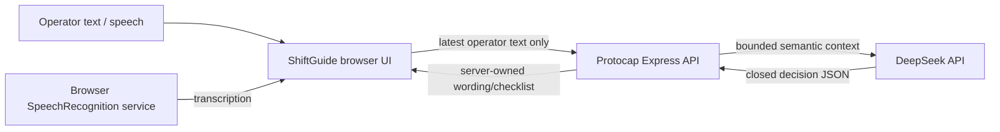

# AI data governance

This document describes the data boundary implemented by Protocap for Céline. It is an engineering/data-governance record, not a substitute for a deployment-specific legal review, DPA or information-security approval.

Last reviewed against public provider/browser documentation: **2026-08-23**.

## Data-flow summary

Céline has two different memories and they must not be confused:

- **UI history** exists for the operator experience and can contain rendered server checklists and local completion state. It is scoped to the authenticated ShiftGuide session by the browser auth boundary.
- **provider context** is an in-memory server structure used only to classify the next operator message. It contains at most four semantic turns: operator text plus Protocap-authorized closed decisions such as `{ "kind": "route", "id": "..." }`. It never contains rendered checklists, procedure action text, checklist completion state, lexicon definitions or emergency wording.

The browser sends only the latest operator turn to `/api/celine/chat`. Older browser conversation content and assistant/checklist DTOs are not retransmitted to the server for provider context. The server owns the compact context sent upstream, so browser-authored assistant history cannot become provider context.

## What Protocap sends to DeepSeek

The DeepSeek request can contain:

- the server-owned classification system prompt;
- the current operator text message;
- up to four previous operator turns from the same active server session;
- the corresponding compact server-authorized decision IDs.

The classification prompt contains route identifiers, route labels/selection guidance, clarification identifiers/questions, lexicon abbreviations and optional non-authoritative site context. It deliberately does **not** need to contain canonical procedure action text, lexicon definitions or emergency wording; those are rendered by Protocap after classification.

Protocap does not send its ShiftGuide bearer token, unlock code or DeepSeek API key as model message content. No `user_id` containing operator identity is sent to DeepSeek.

## Data minimization rules enforced in code

- the browser network client sends only the latest user turn;
- server input rejects an operator turn above 2,000 characters;
- provider context is bounded to four semantic turns;
- provider input is additionally guarded by aggregate prompt/history size ceilings before any external request starts;
- provider context is process memory only and is deleted when the associated ShiftGuide server session is revoked or expires;
- provider responses are parsed into a closed decision protocol;
- provider-authored extra prose is discarded and never shown to the operator;
- rendered checklist/action content comes from validated server configuration, not from the provider;
- application logs record provider error categories and safe token metrics, not prompts, chat messages or API keys.

Provider-call frequency and provider-reported token usage are also bounded by the process-local cost guard documented in `docs/celine-cost-guard.md`. These controls reduce both data exposure and the blast radius of an accidental routing regression.

These controls reduce exposure; they do not make arbitrary operator text non-sensitive. Operators should not enter personal data, passwords, credentials, medical information, disciplinary information, confidential business information unrelated to the procedure, or any other data that is unnecessary for the operational classification task.

## DeepSeek third-party boundary

DeepSeek is an external processor/service boundary. Protocap controls what it sends, but it does not control DeepSeek infrastructure, legal terms, retention or international-transfer practices.

The public DeepSeek Privacy Policy currently states that collected information is stored on DeepSeek servers in mainland China, subject to stated exceptions, and that personal information is retained for the minimum period necessary for the described processing purposes unless other legal requirements apply. The public DeepSeek User Agreement also describes collection/analysis of user input and output information. Deployments must validate the current provider terms and any enterprise/API-specific agreement rather than relying indefinitely on this repository summary.

Primary public references:

- DeepSeek Privacy Policy: https://platform.deepseek.com/downloads/DeepSeek%20Privacy%20Policy.pdf
- DeepSeek User Agreement: https://platform.deepseek.com/downloads/DeepSeek%20User%20Agreement.pdf
- DeepSeek API documentation: https://api-docs.deepseek.com/

For a real industrial deployment, the deployment owner should decide whether the planned data classification is compatible with the provider contract, applicable privacy rules, cross-border-transfer requirements, retention expectations and internal information-security policy. If the answer is not documented, sensitive production/personal data should not be sent to Céline.

## Browser speech-recognition boundary

Céline optionally uses the browser `SpeechRecognition` API. Protocap does not receive raw microphone audio through its Express API; it receives the resulting text when the browser recognition flow produces a transcription.

However, browser speech recognition is not guaranteed to be local. MDN documents that on some browsers, including Chrome configurations, recognition can use a server-based engine and send audio to a web service for processing. Newer implementations expose `SpeechRecognition.processLocally`, `available()` and language-pack installation for on-device recognition, but those capabilities are experimental / not universally available.

References:

- MDN `SpeechRecognition`: https://developer.mozilla.org/en-US/docs/Web/API/SpeechRecognition
- MDN on-device recognition: https://developer.mozilla.org/en-US/docs/Web/API/Web_Speech_API/Using_the_Web_Speech_API
- MDN `processLocally`: https://developer.mozilla.org/en-US/docs/Web/API/SpeechRecognition/processLocally

Therefore microphone use is a separate third-party/browser boundary from DeepSeek. A deployment that requires guaranteed on-device speech recognition must verify browser/platform support and enforce a local-only implementation before enabling voice input; the current demonstrator must not claim that speech audio always remains on the device.

## Deployment checklist

Before approving Céline for data beyond demonstration/non-sensitive operational guidance, record:

1. data classes operators are allowed and forbidden to enter;
2. the active DeepSeek/API contract, DPA if applicable, storage location, retention and deletion terms;
3. international-transfer/privacy assessment required by the deployment jurisdiction;
4. whether browser speech input is enabled and whether on-device recognition is mandatory;
5. who owns incident response and provider-account access;
6. a re-review date for provider/browser terms and capabilities.

The repository intentionally does not claim compliance certifications or contractual guarantees that have not been independently established for a specific deployment.
