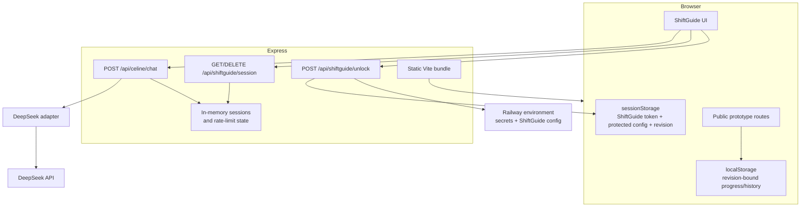

# Architecture and trust boundaries

This document describes the architecture that exists today. It intentionally separates implemented controls from future production-hardening options.

## System shape

Protocap is a React/Vite single-page application served by an Express process. Most public prototypes are browser-side demonstrations. ShiftGuide and Céline cross a server trust boundary because they depend on protected configuration, authentication and an external AI provider.

## Frontend boundaries

The root React router owns the public application surface and delegates `/shiftguide/*` to a dedicated ShiftGuide feature boundary. `src/features/shiftguide/ShiftGuideApp.tsx` owns ShiftGuide authentication, internal routes, legacy redirects and protected route-state handling. This keeps public routing independent from protected feature internals.

Within ShiftGuide, `ShiftGuideLayout` is a shell composer rather than a browser-effects container. Desktop/mobile navigation lives in `src/components/shiftguide/ShiftGuideNavigation.tsx`; scroll restoration, route scroll reset, Céline desktop focus, mobile document locking and `visualViewport` sizing live behind `useShiftGuideShell`.

Progress presentation also consumes a feature-level selector rather than rebuilding persistence semantics inside a page. `useShiftGuideProgressOverview` reads the canonical `shiftguide_progress_v3` contract, which is bound to the server-issued ShiftGuide configuration revision, applies the shared standard/choice summary rules and subscribes to progress changes. Pages therefore do not need to know how alternative choice branches or persistence provenance are represented in storage.

These boundaries are intentionally pragmatic rather than framework-driven: there is no global state library or artificial component hierarchy. Large presentation-heavy pages are left intact unless extracting a boundary removes coupling or creates a meaningful test seam.

## Public/browser-local boundary

Expiry Check, Logistics Call and Packing Calculator use browser persistence. This makes the flows useful as interactive demonstrations without inventing a backend that does not exist. It also means their state is not shared across browsers, users or devices.

Knowledge Base is driven by repository data. LinePulse is a visual decision-support concept backed by `src/data/linePulseMock.json`; it is not connected to a plant data source.

## ShiftGuide boundary

ShiftGuide code is part of the public client bundle, but protected operational configuration is not. The server reads `SG_MODULES`, `SG_LEXIQUE`, `SG_URGENCES` and `SG_SYSTEM_PROMPT` from its environment. Unlock succeeds only when a server-side code comparison passes, after which the server returns a random session token, the protected client payload and a deterministic `configRevision`.

The revision is a SHA-256 identity derived server-side from the validated operational configuration: modules and action text, lexicon, emergency guidance and the additional Céline context. Object-key insertion order does not affect the result. A semantic configuration change therefore creates a new identity even when action IDs are reused.

The browser stores the active ShiftGuide token, protected payload, expiry and revision in `sessionStorage`. The server returns the same revision during session validation. A revision mismatch fails closed instead of allowing an old browser session to claim compatibility with a different procedure.

Revision-bound local data uses a separate persistent copy of the current revision. Progress is stored as format version `3` with its `configRevision`. Existing v1/v2 progress has no trustworthy provenance and is deliberately discarded on the first revision-aware unlock instead of being silently attributed to the current procedure. Céline history is also cleared when the authoritative revision changes. Format version and procedure revision are separate concepts: one describes JSON shape, the other describes operational meaning.

### Shared runtime contract

The server and client use the same runtime validator from `shared/shiftGuideContract.js`. The contract enforces the assumptions made by downstream consumers instead of merely checking broad JSON shape:

- standard modules contain at least one action;
- choice modules contain at least one submodule and every submodule contains at least one action;
- action IDs are globally unique because shared progress is keyed by action ID;
- module and submodule IDs are globally unique because they are progress scopes/routes;
- lexicon sigles are unique case-insensitively;
- emergency content has a typed, non-empty structure.

`SG_URGENCES` is optional at deployment level for backward compatibility: the server supplies the current safe default when the variable is absent. Once resolved, the same typed payload is sent to the UI and injected into Céline's system prompt, avoiding two independent copies of operational emergency content.

## Server process boundary

`server.mjs` is the production process entrypoint only. It reads environment values, creates the DeepSeek adapter and in-memory runtime stores, starts periodic cleanup, then calls `listen`.

The Express application itself is built by `createServerApp` in `server/app.mjs`. The factory receives explicit dependencies and does not open a port or schedule background work. Tests can therefore instantiate a complete API with isolated stores and a deterministic provider, then exercise it over a real ephemeral HTTP socket without starting the production process.

This keeps process lifecycle concerns separate from request handling while avoiding a framework or dependency-injection container.

## Céline boundary

Céline is intentionally server-mediated:

1. the client sends chat history with the ShiftGuide bearer token;
2. the server verifies the session, request shape and rate limit;
3. the server owns the system prompt and provider credential;
4. `server/providers/deepSeekProvider.mjs` owns the DeepSeek-specific request/response envelope and timeout;
5. the server validates provider content against `shared/celineContract.js`;
6. `/api/celine/chat` returns a Protocap-owned `{ message, checklist, followUp }` DTO.

The browser no longer knows DeepSeek's `choices[]` structure. `src/features/shiftguide/celineClient.ts` only knows the Protocap HTTP contract.

The server also verifies every checklist `actionId` against the validated ShiftGuide configuration and rejects duplicate or unknown IDs. A provider response therefore cannot create arbitrary progress keys even if the model ignores its prompt instructions.

## Security controls implemented today

- timing-safe secret comparison;
- random 256-bit session tokens;
- eight-hour session TTL;
- reactive browser expiry enforcement with foreground revalidation;
- server-issued configuration revision enforced across session, progress and Céline-history lifecycles;
- per-IP unlock throttling, per-IP chat throttling and per-session chat throttling;
- 128 KB JSON body limit;
- generic client-facing provider/server errors;
- CSP, frame denial, MIME sniffing protection, restrictive permissions policy and referrer policy;
- `Cache-Control: no-store` for API routes;
- HSTS when the request is secure;
- DeepSeek request timeout;
- server-side validation of Céline's provider response and operational action IDs.

## Deliberate current trade-offs

### Process-local session state

Sessions and rate-limit buckets are JavaScript `Map` instances in the Express process. A restart invalidates active sessions. Multiple replicas would not share state. The current hosted demonstrator does not pretend otherwise.

A distributed store such as Redis would become justified if horizontal scaling, durable sessions or cross-instance throttling became real requirements.

### Provider availability

The DeepSeek adapter is the only production provider today. The application boundary is provider-independent, but no artificial multi-provider abstraction or fallback routing is implemented because there is no current product requirement for it.

## Deployment boundary

Railway hosts the current public demonstrator. CI and deployment are separate concerns: GitHub Actions proves repository checks pass; it does not by itself prove the external Railway deployment completed successfully.
