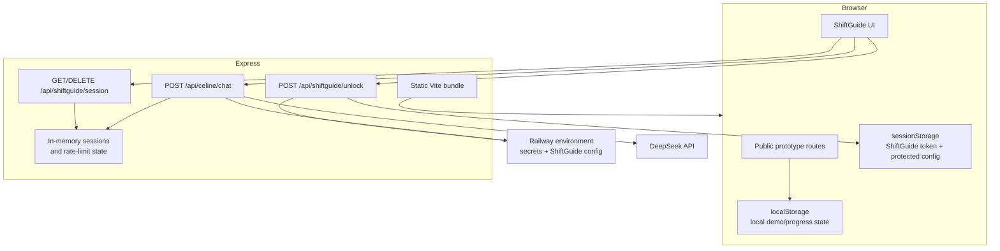

# Architecture and trust boundaries

This document describes the architecture that exists today. It intentionally separates implemented controls from future production-hardening options.

## System shape

Protocap is a React/Vite single-page application served by an Express process. Most public prototypes are browser-side demonstrations. ShiftGuide and Céline cross a server trust boundary because they depend on protected configuration, authentication and an external AI provider.

## Public/browser-local boundary

Expiry Check, Logistics Call and Packing Calculator use browser persistence. This makes the flows useful as interactive demonstrations without inventing a backend that does not exist. It also means their state is not shared across browsers, users or devices.

Knowledge Base is driven by repository data. LinePulse is a visual decision-support concept backed by `src/data/linePulseMock.json`; it is not connected to a plant data source.

## ShiftGuide boundary

ShiftGuide code is part of the public client bundle, but protected operational configuration is not. The server reads `SG_MODULES`, `SG_LEXIQUE`, `SG_URGENCES` and `SG_SYSTEM_PROMPT` from its environment. Unlock succeeds only when a server-side code comparison passes, after which the server returns a random session token and the protected client payload.

The browser stores the active ShiftGuide token and protected payload in `sessionStorage`. The server validates the token for protected API calls.

### Shared runtime contract

The server and client use the same runtime validator from `shared/shiftGuideContract.js`. The contract enforces the assumptions made by downstream consumers instead of merely checking broad JSON shape:

- standard modules contain at least one action;
- choice modules contain at least one submodule and every submodule contains at least one action;
- action IDs are globally unique because shared progress is keyed by action ID;
- module and submodule IDs are globally unique because they are progress scopes/routes;
- lexicon sigles are unique case-insensitively;
- emergency content has a typed, non-empty structure.

`SG_URGENCES` is optional at deployment level for backward compatibility: the server supplies the current safe default when the variable is absent. Once resolved, the same typed payload is sent to the UI and injected into Céline's system prompt, avoiding two independent copies of operational emergency content.

## Céline boundary

Céline is intentionally server-mediated:

1. the client sends chat history with the ShiftGuide bearer token;
2. the server verifies the session and rate limit;
3. the server owns the system prompt and provider credential;
4. the server normalises/limits chat input and applies an upstream timeout;
5. the server calls DeepSeek and returns the response.

This prevents the provider credential and protected system prompt from being shipped in the public bundle.

## Security controls implemented today

- timing-safe secret comparison;
- random 256-bit session tokens;
- eight-hour session TTL;
- per-IP unlock throttling and per-session chat throttling;
- 128 KB JSON body limit;
- generic client-facing provider/server errors;
- CSP, frame denial, MIME sniffing protection, restrictive permissions policy and referrer policy;
- `Cache-Control: no-store` for API routes;
- HSTS when the request is secure;
- DeepSeek request timeout.

## Deliberate current trade-offs

### Process-local session state

Sessions and rate-limit buckets are JavaScript `Map` instances in the Express process. A restart invalidates active sessions. Multiple replicas would not share state. The current hosted demonstrator does not pretend otherwise.

A distributed store such as Redis would become justified if horizontal scaling, durable sessions or cross-instance throttling became real requirements.

### Server startup and testability

`server.mjs` currently creates the Express application and calls `app.listen` in the same module. Helper logic is tested independently, but full HTTP integration testing would be easier after separating application construction from process startup.

### Provider response coupling

`/api/celine/chat` currently returns the provider payload. A stronger external-service boundary would map this to a Protocap-owned DTO so the frontend is not coupled to DeepSeek's response shape.

## Deployment boundary

Railway hosts the current public demonstrator. CI and deployment are separate concerns: GitHub Actions proves repository checks pass; it does not by itself prove the external Railway deployment completed successfully.
