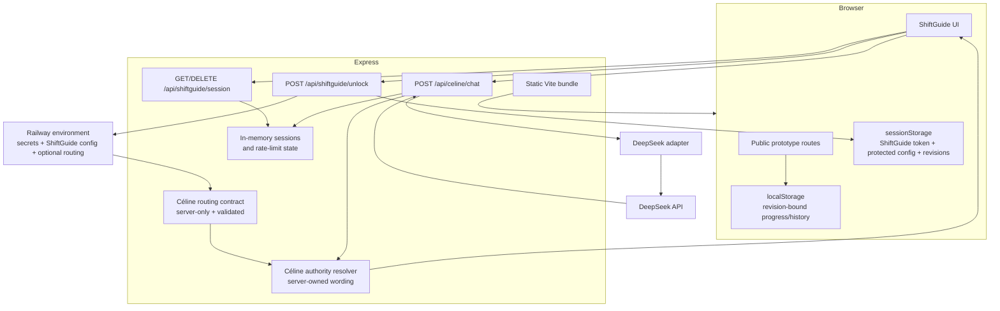

# Architecture and trust boundaries

This document describes the architecture that exists today. It intentionally separates implemented controls from future production-hardening options.

## System shape

Protocap is a React/Vite single-page application served by an Express process. Most public prototypes are browser-side demonstrations. ShiftGuide and Céline cross a server trust boundary because they depend on protected configuration, authentication and an external AI provider.

## Frontend boundaries

The root React router owns the public application surface and delegates `/shiftguide/*` to a dedicated ShiftGuide feature boundary. `src/features/shiftguide/ShiftGuideApp.tsx` owns ShiftGuide authentication, internal routes, legacy redirects and protected route-state handling. This keeps public routing independent from protected feature internals.

Within ShiftGuide, `ShiftGuideLayout` is a shell composer rather than a browser-effects container. Desktop/mobile navigation lives in `src/components/shiftguide/ShiftGuideNavigation.tsx`; scroll restoration, route scroll reset, Céline desktop focus, mobile document locking and `visualViewport` sizing live behind `useShiftGuideShell`.

Progress presentation consumes a feature-level selector rather than rebuilding persistence semantics inside a page. `useShiftGuideProgressOverview` reads the canonical `shiftguide_progress_v3` contract, which is bound to the server-issued ShiftGuide configuration revision, applies the shared standard/choice summary rules and subscribes to progress changes.

These boundaries are intentionally pragmatic rather than framework-driven: there is no global state library or artificial component hierarchy.

## Public/browser-local boundary

Expiry Check, Logistics Call and Packing Calculator use browser persistence. This makes the flows useful as interactive demonstrations without inventing a backend that does not exist. It also means their state is not shared across browsers, users or devices.

Knowledge Base is driven by repository data. LinePulse is a visual decision-support concept backed by `src/data/linePulseMock.json`; it is not connected to a plant data source.

## ShiftGuide boundary

ShiftGuide code is part of the public client bundle, but protected operational configuration is not. The server reads `SG_MODULES`, `SG_LEXIQUE`, `SG_URGENCES`, `SG_SYSTEM_PROMPT` and optionally `SG_CELINE_ROUTING` from its environment. Unlock succeeds only when a server-side code comparison passes, after which the server returns a random session token, the protected client payload, a deterministic `configRevision` and the current `celineAuthorityRevision`.

The configuration revision is a SHA-256 identity derived server-side from the validated operational configuration: modules and action text, lexicon, emergency guidance and the additional Céline context. Object-key insertion order does not affect the result.

The browser stores the active ShiftGuide token, protected payload, expiry and both server revisions in `sessionStorage`. The server returns the same identities during session validation. A revision mismatch fails closed instead of allowing an old browser session to claim compatibility with a different procedure or AI authority protocol.

Revision-bound local data uses a separate persistent copy of the current configuration revision. Progress is stored as format version `3` with its `configRevision`. Existing v1/v2 progress has no trustworthy provenance and is deliberately discarded on the first revision-aware unlock. Céline history is cleared when either the operational configuration changes or the Céline authority protocol/routing changes. A routing-only change does not erase operator progress.

### Runtime contracts

The server and client use the same ShiftGuide runtime validator from `shared/shiftGuideContract.js`. It enforces module/action uniqueness and complete typed safety content.

Céline routing has a separate server-only compatibility contract in `server/celineRoutingContract.mjs`. A routing spec declares route IDs, labels, selection guidance, ordered action IDs, clarification questions and classifier rules. Validation happens only after ShiftGuide itself is valid, because routing validity depends on the exact configured action catalog.

Every declared route must resolve entirely against the active ShiftGuide action IDs. Duplicate route IDs, duplicate action IDs inside one route, malformed clarifications or empty classifier rules are rejected. When ShiftGuide is enabled, an incompatible routing spec throws during application construction: the server does not silently omit unsupported capabilities.

When `SG_CELINE_ROUTING` is absent, `server/celineRoutingDefault.mjs` provides the repository's current routing contract. Tests and alternate deployments can provide their own complete routing spec without changing browser data or the authority engine.

The `celineAuthorityRevision` is content-addressed from the validated routing specification plus the decision-protocol revision. Changing routing semantics therefore changes the authority identity automatically; there is no manual version constant to remember to bump.

## Server process boundary

`server.mjs` is the production process entrypoint only. It reads environment values, resolves defaults, creates the DeepSeek adapter and in-memory runtime stores, starts periodic cleanup, then calls `listen`.

The Express application itself is built by `createServerApp` in `server/app.mjs`. The factory receives explicit dependencies and does not open a port or schedule background work. Tests can therefore instantiate a complete API with isolated stores, explicit routing and a deterministic provider, then exercise it over a real ephemeral HTTP socket.

This keeps process lifecycle concerns separate from request handling while avoiding a framework or dependency-injection container.

## Céline boundary

Céline is server-mediated and the model is not an operational-content authority:

1. the client sends chat history with the ShiftGuide bearer token;
2. the server verifies the session, request shape and rate limits;
3. the server owns the classification prompt, provider credential and validated routing contract;
4. `server/providers/deepSeekProvider.mjs` owns the DeepSeek-specific request/response envelope and timeout;
5. the provider may return only a compact decision such as a route ID, clarification ID, lexicon key, emergency topic or `unknown`;
6. `shared/celineContract.js` rejects free-form provider fields and malformed decision shapes;
7. `server/celineAuthority.mjs` resolves the decision against the current validated configuration and routing contract, then renders all operator-facing wording, checklist content and follow-up text;
8. `/api/celine/chat` returns the Protocap-owned `{ message, checklist, followUp }` DTO to the browser.

The prompt and resolver derive their route/clarification semantics from the same declarative contract. There is no second list of hard-coded action IDs hidden in the prompt or authority engine. `decisionGuide` values and classifier rules guide model selection, while action text remains server-owned and is not copied into the provider prompt.

Procedure text, lexicon definitions and emergency wording do not need to be copied into the provider prompt to be rendered. A syntactically valid but unknown route is rejected. A provider response that adds its own `message`, checklist or instruction is rejected rather than partially trusted.

`SG_SYSTEM_PROMPT` remains non-authoritative site context. It may influence classification but cannot introduce new routes, instructions or operator-facing responses.

## Security controls implemented today

- timing-safe secret comparison;
- random 256-bit session tokens;
- eight-hour session TTL;
- reactive browser expiry enforcement with foreground revalidation;
- server-issued configuration revision enforced across session, progress and Céline-history lifecycles;
- content-addressed Céline authority/routing revision with history-only invalidation;
- fail-fast compatibility validation between Céline routes and the active procedure action catalog;
- closed provider decision protocol with rejection of free-form operator content;
- server-owned rendering of procedure actions, clarification wording, lexicon facts and emergency guidance;
- per-IP unlock throttling, per-IP chat throttling and per-session chat throttling;
- 128 KB JSON body limit;
- generic client-facing provider/server errors;
- CSP, frame denial, MIME sniffing protection, restrictive permissions policy and referrer policy;
- `Cache-Control: no-store` for API routes;
- HSTS when the request is secure;
- DeepSeek request timeout.

## Deliberate current trade-offs

### Process-local session state

Sessions and rate-limit buckets are JavaScript `Map` instances in the Express process. A restart invalidates active sessions. Multiple replicas would not share state. The current hosted demonstrator does not pretend otherwise.

A distributed store such as Redis would become justified if horizontal scaling, durable sessions or cross-instance throttling became real requirements.

### Provider availability

The DeepSeek adapter is the only production provider today. The application boundary is provider-independent, but no artificial multi-provider abstraction or fallback routing is implemented because there is no current product requirement for it.

### Routing governance

Routing is configurable but intentionally not editable from the browser or an admin UI. It is server-side deployment configuration and must be changed atomically with any procedure changes it depends on. A future production workflow may add schema tooling or reviewed configuration publishing, but the runtime invariant is already enforced today.

## Deployment boundary

Railway hosts the current public demonstrator. CI and deployment are separate concerns: GitHub Actions proves repository checks pass; it does not by itself prove the external Railway deployment completed successfully.
